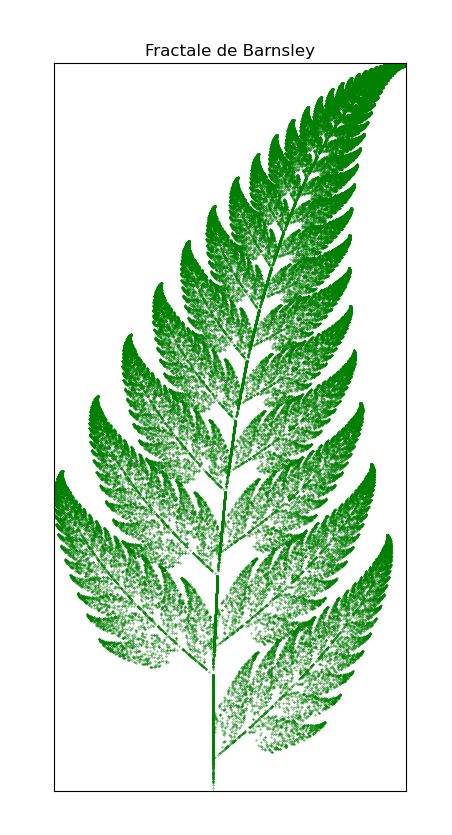

# Fractale
Ce projet permet de générer et d'afficher différentes fractales en C++ et Python. Il n'est pas fait pour générer des images de hautes résolutions mais de découvrir différents types de fractale et l'implémentation des différents processus mathématiques permettant de les observer.

Vous pouvez essayer de changement des paramètres dans la main pour obtenir des résultats différents.



## Structure du projet

- **build/** : Fichiers générés par CMake et Makefile lors de la compilation.
- **data/** : Données utilisées pour les fractales (ex : `von_koch_data.txt`).
- **include/** : Fichiers d'en-tête C++ (headers), dont `Fractale.hpp` et `VonKoch.hpp`.
- **src/** : Code source C++ principal (`main.cpp`).
- **display.py** : Script Python pour afficher les résultats ou manipuler les images générées.
- **CMakeLists.txt** : Fichier de configuration pour la compilation avec CMake.

## Compilation (C++)
```
mkdir build
cd build
cmake ..
make
```
L'exécutable sera généré dans le dossier build/.

Utilisation des scripts Python
Depuis le fichier :
python3 [display.py]

## Auteurs
BATAILLE Ewan

## Licence
Ce projet est sous licence MPL 2.0 (voir les fichiers sources pour plus de détails).